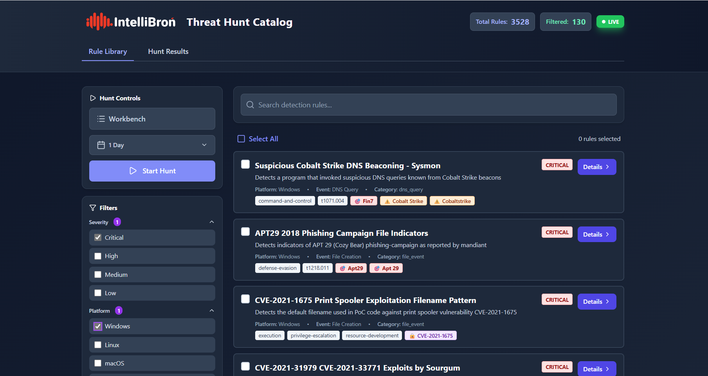
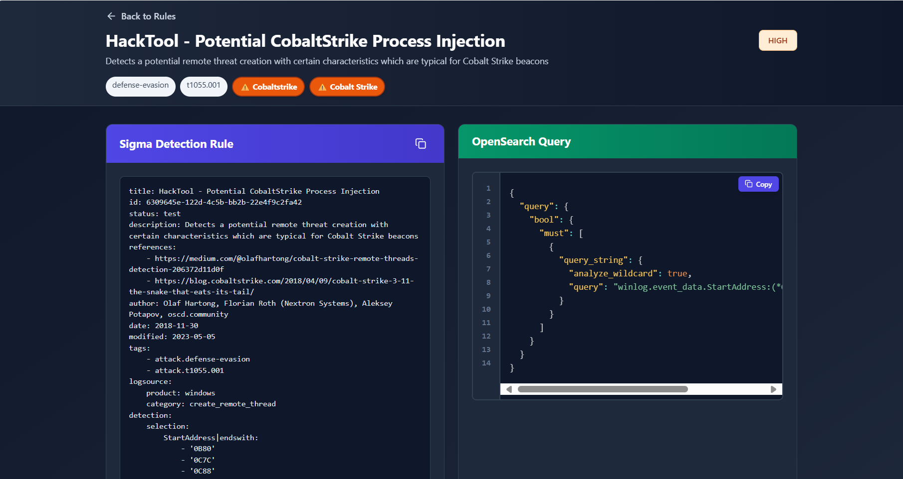
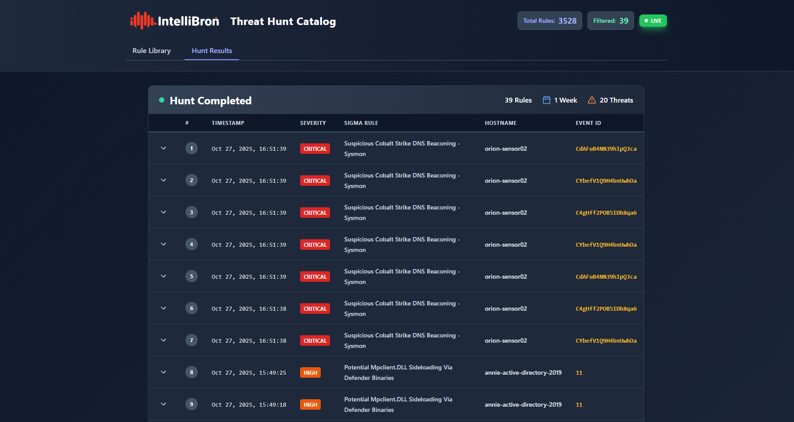

# Threat Hunt Catalog

> **⚠️ Disclaimer:** This tool was developed as a proof of concept (POC). It's not production-ready and should NOT be used in production environments or exposed on public networks. Use at your own risk!

Ever found yourself manually copying Sigma rules, converting them one by one, and pasting queries into your SIEM? Yeah, we've been there too. It's tedious, time-consuming, and frankly, not a great use of your time when there are actual threats to hunt.

This platform solves that problem. It takes the brilliant concept of Sigma rules and turns it into something you can actually use every day. Browse over 3,500 detection rules, filter by threat intel (APT groups, malware families, CVEs), select multiple rules, and launch hunts across your environment—all from one interface. No more context switching between terminals, converters, and your SIEM. The goal? Get you from "I need to hunt for Cobalt Strike" to "Here are the results" in under 5 minutes.







## Key Features

- **3,500+ Sigma Rules Ready to Go** – All pre-converted to OpenSearch queries. No manual conversion needed.
- **Smart Threat Intel Filtering** – Find rules by APT groups (APT29, Lazarus), malware families (Cobalt Strike, Mimikatz), or CVEs.
- **Multi-Rule Hunts** – Select 10, 20, or 50 rules and run them all at once. Results come back organized and ready to investigate.
- **Live Connection Indicator** – Know instantly if you're connected to your OpenSearch cluster (green = live, red = check your config).
- **Flexible Time Windows** – Last 6 hours? 7 days? Custom date range? You pick.
- **Real-Time Results** – Watch your hunt progress live, see threats as they're detected, and dive into event details immediately.

## Getting Started

### Tested Environments
This tool has been tested on:
- **Windows 11 Pro**
- **Ubuntu 24.04 LTS**

### Prerequisites
- **Docker & Docker Compose** (recommended) OR **Node.js 16+** and **Python 3.8+**
- An OpenSearch/Elasticsearch cluster (for real hunts)

---

### Installation Option 1: Docker Compose (Recommended)

The easiest way to get up and running:

1. **Clone the repository:**
   ```bash
   git clone https://github.com/itsec-research/sigma-detection-app.git
   cd sigma-detection-app
   ```

2. **Configure your OpenSearch connection:**
   ```bash
   cp .env.example .env
   # Edit .env and set your OpenSearch URL and credentials:
   # VITE_OPENSEARCH_URL=http://your-opensearch:9200
   # VITE_OPENSEARCH_USERNAME=admin
   # VITE_OPENSEARCH_PASSWORD=your-password
   ```

3. **Start everything with Docker Compose:**
   ```bash
   docker-compose up -d
   ```

4. **Access the app:**
   Open your browser and navigate to: `http://localhost:5173`


---

### Installation Option 2: Manual Setup (npm install)

If you prefer to run things manually:

1. **Clone the repository:**
   ```bash
   git clone https://github.com/itsec-research/sigma-detection-app.git
   cd sigma-detection-app
   ```

2. **Install Node.js dependencies:**
   ```bash
   npm install
   ```

3. **Install Python dependencies:**
   ```bash
   pip install -r requirements.txt
   ```

4. **Configure your OpenSearch connection:**
   ```bash
   cp .env.example .env
   # Edit .env with your OpenSearch details:
   # VITE_OPENSEARCH_URL=http://your-opensearch:9200
   # VITE_OPENSEARCH_USERNAME=admin
   # VITE_OPENSEARCH_PASSWORD=your-password
   ```

5. **Load the Sigma rules** (this converts all YAML rules to OpenSearch queries):
   ```bash
   npm run load-sigma
   ```

6. **Start the backend** (in a separate terminal):
   ```bash
   npm run start-backend
   ```

7. **Start the frontend** (in another terminal):
   ```bash
   npm run dev
   ```

8. **Access the app:**
   Open your browser to: `http://localhost:5173`

## Contributing

This project was built to solve a real problem, and we're constantly improving it. Found a bug? Have an idea for a feature? Want to add more threat intel patterns?

**We'd love your help!**

- **Report Issues:** Open an issue on GitHub if something breaks or could be better.
- **Submit Pull Requests:** Got a fix or feature? PRs are welcome.
- **Share Feedback:** Even just "hey, this worked great for hunting X" is valuable. Let us know how you're using it.

This is a community tool, and your contributions make it better for everyone.

## Acknowledgments

This platform was built with AI assistance. It's functional, useful, and constantly evolving.

Huge thanks to the [Sigma project](https://github.com/SigmaHQ/sigma) for creating the standard that makes this all possible.

---

**Built by security analysts, for security analysts. Happy hunting! 🎯**
